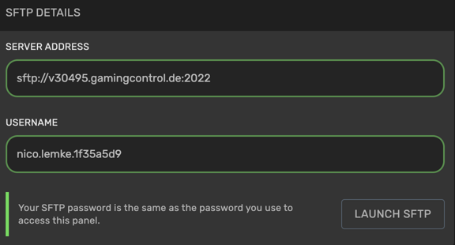

#  Wie installiere ich Spigot oder Bungeecord auf meinem Rootserver

## Wie installiere ich Spigot auf meinem Rootserver?

Um Spigot auf deinem Server zu installieren benötigst du eine Spigot Jar.
Diese kannst du hier downloaden: 


Wenn du die passende Version auf deinem Computer hast gehe auf



Dort wähle den Server aus und klicke auf "Einstellungen".
Dort findest du die SFTP Login Daten.

Diese gebe in deinem FTP Client ein. (z.B. FileZilla oder WinSCP)
Alternativ kannst du "Launch SFTP" anklicken. Damit startet sich dein FTP Programm automatisch und du musst nur noch dein Passwort eingeben.

Wenn du erfolgreich verbunden bist musst du die Spigot Jar in das Hauptverzeichnis ziehen.

Sobald die Jar fertig hochgeladen ist wechsel wieder auf Pterodactyl.


Dort klicke auf "Startkonfiguration".

Schreibe unter "SERVER JAR FILE" den Namen der gerade hochgeladenen Jar Datei rein. z.B. spigot.jar

Sobald dies gemacht ist muss die passende Java Version ausgewählt werden.
Dazu gehe unter "Startkonfiguration" auf "DOCKER IMAGE".

Welche Java Version benötige ich?

1.8.x Java 8

1.9.x Java 8

1.10.x Java 8

1.11.x Java 8

1.12.x Java 11

1.13.x Java 11

1.14.x Java 11

1.15.x Java 11

1.16.x Java 11

1.17.x Java 17

1.18.x Java 17

1.19.x Java 17

